# Wormhole
**Wormhole allows you to expose local web servers sitting behind NATs or firewalls to the public internet securely. It is designed as a lightweight, single-binary alternative to tools like Ngrok or Cloudflare Tunnels.**

## Installation
Download the latest standalone binary for your system directly from the links below.
* **Windows:** [Download wormhole-windows-amd64.exe](https://github.com/joshuadlima/Wormhole/releases/latest/download/wormhole-windows-amd64.exe)
* **Mac (Apple Silicon):** [Download wormhole-mac-silicon](https://github.com/joshuadlima/Wormhole/releases/latest/download/wormhole-mac-silicon)
* **Mac (Intel):** [Download wormhole-mac-intel](https://github.com/joshuadlima/Wormhole/releases/latest/download/wormhole-mac-intel)
* **Linux:** [Download wormhole-linux-amd64](https://github.com/joshuadlima/Wormhole/releases/latest/download/wormhole-linux-amd64)

## The Wormhole CLI (Usage)
### 1. Clone the repo and build the binary, or install the latest binary directly from the links above.
```bash
    git clone https://github.com/joshuadlima/Wormhole.git
    cd Wormhole
    go build -o wormhole main.go
```

### 2. Start the server.
Run this on your cloud VPS or a central machine. It will open port 8080 for clients to connect, and port 9090 for web visitors.
```bash
    ./wormhole server
```

### 3. Start the client.
Run this on your local laptop to expose a local web app (e.g., running on port 4200) to the public internet.
If you leave the --subdomain flag blank, Wormhole will automatically generate a secure, random 32-character hex string for you.
```bash
    ./wormhole client --subdomain joshua --local 4200
```

### 4. Visit your app!
Open your browser and navigate to: http://joshua.localhost:9090 (or your server's public IP/Domain).

## Design & Architecture

```mermaid
flowchart TB
    %% Define the styles
    classDef clientBox fill:#eef2ff,stroke:#6366f1,stroke-width:2px,color:#000
    classDef serverBox fill:#f0fdf4,stroke:#22c55e,stroke-width:2px,color:#000
    classDef protocolBox fill:#faf5ff,stroke:#a855f7,stroke-width:2px,color:#000
    classDef proxyBox fill:#fff7ed,stroke:#f97316,stroke-width:2px,color:#000
    classDef trafficBox fill:#fefce8,stroke:#eab308,stroke-width:2px,color:#000

    subgraph Architecture [Reverse Tunnel Architecture]
        direction LR
        
        subgraph ClientNode [Client]
            direction TB
            LS["<b>Local Service</b><br>Port: 3000 (example)"]:::clientBox
            OC["<b>Outbound Connection</b><br>→ Server:8080<br>→ Send subdomain<br>→ Establish Yamux session"]:::clientBox
            YC["<b>Yamux Client</b><br>Multiplexed streams over<br>single TCP connection"]:::protocolBox
            
            LS -.- OC -.- YC
        end

        subgraph ProtocolNode [Network]
            direction TB
            PF["<b>Protocol Flow:</b><br>1. Raw TCP handshake<br>2. Subdomain exchange<br>3. Convert to Yamux session<br>4. All traffic via Yamux streams"]:::protocolBox
        end

        subgraph ServerNode [Server]
            direction TB
            P80["<b>Port 8080</b><br>• Accept client connections<br>• Receive subdomain<br>• Convert to Yamux session<br>• Map subdomain → session"]:::serverBox
            YS["<b>Yamux Server</b><br>Manages multiple client sessions"]:::protocolBox
            RP["<b>httputil.ReverseProxy</b><br>Routes HTTP requests to<br>correct Yamux session"]:::proxyBox
            P90["<b>Port 9090</b><br>• Public traffic endpoint<br>• Parse Host header<br>• Route by subdomain"]:::serverBox

            P80 -.-> YS -.-> RP -.-> P90
        end

        %% Connections between subgraphs
        YC <==>|Yamux Frames| PF <==>|Yamux Frames| P80
    end

    %% Spacer to force the traffic flow below the architecture
    Architecture ~~~ Traffic

    subgraph Traffic [Public Traffic Flow]
        direction LR
        V(("🌐<br><b>Visitor</b>")):::trafficBox
        S1["<b>1. HTTP Request</b><br>GET [http://app1.tunnel.io](http://app1.tunnel.io)"]:::clientBox
        S2["<b>2. Server :9090</b><br>Extract Host: app1.tunnel.io"]:::serverBox
        S3["<b>3. Route via Subdomain</b><br>Match 'app1' → Yamux session"]:::protocolBox
        S4["<b>4. Proxy to Client</b><br>ReverseProxy → Yamux frames"]:::proxyBox

        V --> S1 --> S2 --> S3 --> S4
    end
```


### 1. TCP Multiplexing (Yamux)
- Packs thousands of concurrent HTTP requests into a single, persistent, underlying TCP connection.
